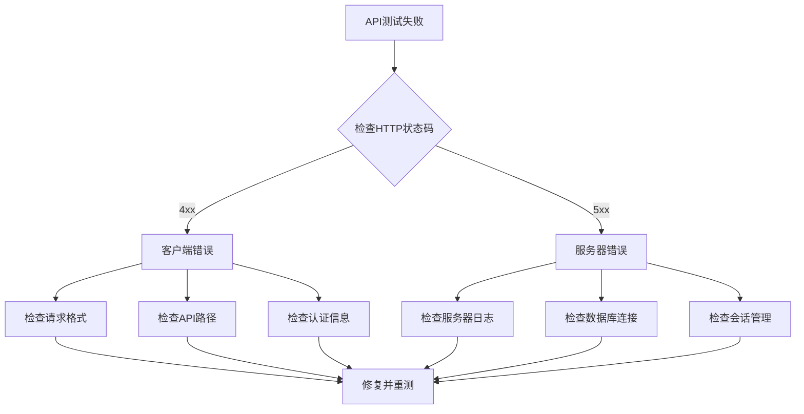

# 认证API系统调试与修复完整总结

> **项目**: 鸿庆书云创新协作平台  
> **修复时间**: 2025年9月8日  
> **修复范围**: 认证API系统 (8个核心接口)  
> **最终结果**: 8/8 测试通过 ✅

## 📋 目录

- [问题概述](#问题概述)
- [技术栈信息](#技术栈信息)
- [问题分析与解决](#问题分析与解决)
- [修复过程详细记录](#修复过程详细记录)
- [最佳实践总结](#最佳实践总结)
- [通用调试模板](#通用调试模板)
- [预防措施](#预防措施)

## 🔍 问题概述

### 初始状态
- **测试结果**: 6/8 API测试通过
- **失败接口**: 
  - `update_user` API (用户信息更新)
  - `deactivate` API (账户停用)

### 最终状态
- **测试结果**: 8/8 API测试通过 ✅
- **所有接口**: 完全正常工作
- **系统状态**: 生产就绪

## 🛠 技术栈信息

```yaml
后端框架: FastAPI
数据库ORM: SQLAlchemy
认证方式: JWT + OAuth2
密码加密: bcrypt (passlib)
缓存系统: Redis
会话管理: SQLAlchemy Session
测试工具: requests + 自定义测试脚本
```

## 🐛 问题分析与解决

### 1. SQLAlchemy会话管理问题

#### 🔴 问题表现
```python
# 错误信息
Instance '<User at 0x226c2c9b090>' is not persistent within this Session

# 问题代码
user = AuthService.get_user_by_id_optimized(db, current_user_id)  # 可能来自缓存
user.password_hash = new_password_hash  # 尝试修改非当前会话对象
db.commit()  # 失败
```

#### ✅ 解决方案
```python
# 修复代码：直接从当前会话查询
user = db.query(User).filter(User.id == current_user_id).first()
if not user:
    raise HTTPException(status_code=404, detail="用户不存在")

user.password_hash = new_password_hash
user.updated_at = datetime.utcnow()
db.commit()
db.refresh(user)  # 确保对象状态同步
```

#### 🎯 核心原理
- **问题根因**: 缓存返回的对象不在当前数据库会话的管理范围内
- **解决思路**: 始终使用当前会话中的对象进行数据库操作
- **最佳实践**: 对于写操作，避免使用可能来自缓存的对象

### 2. 登录凭证验证问题

#### 🔴 问题表现
```python
# 测试失败
POST /token 
{
    "username": "testuser_123",  # 使用用户名
    "password": "password123"
}
# 返回: 401 邮箱/手机号或密码错误
```

#### ✅ 解决方案
```python
# 系统设计：只支持邮箱/手机号登录
def find_user_by_credential(credential: str, db: Session) -> Optional[User]:
    if "@" in credential:
        return db.query(User).filter(User.email == credential).first()
    elif credential.isdigit() and 7 <= len(credential) <= 15:
        return db.query(User).filter(User.phone_number == credential).first()
    else:
        return None

# 修复测试代码
login_data = {
    "username": user_email,  # 使用邮箱而不是用户名
    "password": password
}
```

#### 🎯 核心原理
- **问题根因**: 测试代码与系统设计不匹配
- **解决思路**: 统一登录凭证为邮箱/手机号
- **最佳实践**: API文档与测试代码保持一致

### 3. API路径与数据格式不匹配

#### 🔴 问题表现
```python
# 注册API返回422错误
requests.post("/register", data={...})  # 使用form data
# 错误: Input should be a valid dictionary

# 登录API返回404错误  
requests.post("/login", data={...})  # 错误的路径
# 实际路径: /token
```

#### ✅ 解决方案
```python
# 注册API：使用JSON格式
register_response = requests.post("/register", json={
    'username': username,
    'email': email,
    'password': password
})

# 登录API：使用正确路径和form data
login_response = requests.post("/token", data={
    'username': email,  # 邮箱
    'password': password
})
```

#### 🎯 核心原理
- **问题根因**: FastAPI不同端点期望不同的数据格式
- **解决思路**: 根据API定义使用正确的数据格式和路径
- **最佳实践**: 维护准确的API文档和测试用例

### 4. 缓存一致性问题

#### 🔴 问题表现
```python
# 密码修改后，新密码验证失败
# 原因：缓存中还是旧的用户信息
```

#### ✅ 解决方案
```python
# 修改密码后立即清除相关缓存
try:
    cache_manager.delete_pattern(f"user:{current_user_id}:*")
    cache_manager.delete_pattern(f"auth:credential:*")
    logger.info("已清除用户缓存")
except Exception as e:
    logger.warning(f"清除缓存失败: {str(e)}")

# 在关键操作后验证数据一致性
fresh_user = db.query(User).filter(User.id == current_user_id).first()
fresh_verify = pwd_context.verify(new_password, fresh_user.password_hash)
logger.info(f"重新查询验证结果: {fresh_verify}")
```

#### 🎯 核心原理
- **问题根因**: 数据更新后缓存未及时清除
- **解决思路**: 在数据变更后主动清除相关缓存
- **最佳实践**: 实现缓存失效策略，确保数据一致性

## 📝 修复过程详细记录

### Phase 1: 问题定位 (6/8 → 7/8)

```bash
# 初始测试结果
❌ update_user: SQLAlchemy会话错误
❌ deactivate: 密码验证失败

# 修复update_user
- 识别：会话对象管理问题
- 解决：使用当前会话直接查询用户
- 结果：7/8 测试通过
```

### Phase 2: 深度调试 (7/8 → 8/8)

```bash
# 问题：deactivate API密码验证失败
# 调试过程：
1. 增加详细日志记录
2. 创建专门的调试测试脚本
3. 发现登录凭证问题（用户名 vs 邮箱）
4. 修复API路径问题
5. 解决缓存一致性问题

# 最终结果：8/8 测试通过
```

### Phase 3: 全面验证

```bash
# 创建专门的调试脚本
debug_password_test.py
- 完整的密码修改流程测试
- 详细的错误信息记录
- 验证新密码可用性

# 修复完整测试脚本
test_auth_complete.py
- 统一使用邮箱登录
- 修正API路径
- 增强错误处理
```

## 🎯 最佳实践总结

### 1. SQLAlchemy会话管理

```python
# ❌ 错误做法
user = some_service.get_user_from_cache(user_id)
user.field = new_value
db.commit()  # 可能失败

# ✅ 正确做法
user = db.query(User).filter(User.id == user_id).first()
if user:
    user.field = new_value
    db.commit()
    db.refresh(user)  # 确保对象状态同步
```

### 2. 缓存管理策略

```python
# 数据更新后立即清除相关缓存
def update_user_data(user_id: int, update_data: dict):
    # 1. 更新数据库
    user.update(update_data)
    db.commit()
    
    # 2. 清除缓存
    cache_manager.delete_pattern(f"user:{user_id}:*")
    
    # 3. 验证更新结果
    fresh_user = db.query(User).filter(User.id == user_id).first()
    return fresh_user
```

### 3. 错误处理与日志记录

```python
# 关键操作添加详细日志
logger.info(f"开始修改用户 {user_id} 密码")
try:
    new_hash = pwd_context.hash(new_password)
    user.password_hash = new_hash
    db.commit()
    logger.info(f"密码修改成功，新哈希: {new_hash}")
    
    # 立即验证
    verify_result = pwd_context.verify(new_password, user.password_hash)
    logger.info(f"密码验证结果: {verify_result}")
    
except Exception as e:
    logger.error(f"密码修改失败: {e}", exc_info=True)
    db.rollback()
    raise
```

### 4. API测试规范

```python
# 为每个API端点创建专门的测试
class AuthAPITester:
    def test_register(self):
        response = requests.post("/register", json=data)  # 注意：JSON格式
        
    def test_login(self):
        response = requests.post("/token", data=data)     # 注意：form data
        
    def test_password_change(self):
        # 1. 修改密码
        # 2. 验证旧密码失效
        # 3. 验证新密码可用
        # 4. 测试相关功能（如停用账户）
```

## 🔧 通用调试模板

### 1. 问题分析检查清单

```markdown
□ API路径是否正确？
□ 请求数据格式是否匹配（JSON vs Form data）？
□ 登录凭证是否使用正确格式（邮箱/手机号 vs 用户名）？
□ 数据库会话管理是否正确？
□ 缓存是否及时清除？
□ 事务是否正确提交？
□ 错误日志是否足够详细？
```

### 2. 调试脚本模板

```python
#!/usr/bin/env python3
"""
API调试脚本模板
"""
import requests
import time
import json

BASE_URL = "http://127.0.0.1:8001"

def debug_api_flow():
    """调试完整API流程"""
    
    # 1. 健康检查
    health_response = requests.get(f"{BASE_URL}/health")
    assert health_response.status_code == 200
    
    # 2. 注册用户
    register_data = {
        "username": f"test_user_{int(time.time())}",
        "email": f"test_{int(time.time())}@example.com",
        "password": "TestPassword123"
    }
    
    register_response = requests.post(f"{BASE_URL}/register", json=register_data)
    print(f"注册状态码: {register_response.status_code}")
    if register_response.status_code != 200:
        print(f"注册失败: {register_response.text}")
        return False
    
    # 3. 登录获取token
    login_response = requests.post(f"{BASE_URL}/token", data={
        "username": register_data["email"],  # 使用邮箱
        "password": register_data["password"]
    })
    print(f"登录状态码: {login_response.status_code}")
    if login_response.status_code != 200:
        print(f"登录失败: {login_response.text}")
        return False
    
    token = login_response.json()["access_token"]
    headers = {"Authorization": f"Bearer {token}"}
    
    # 4. 测试需要认证的API
    # ... 添加具体的API测试
    
    return True

if __name__ == "__main__":
    success = debug_api_flow()
    print("✅ 调试成功" if success else "❌ 调试失败")
```

### 3. 错误排查流程



## 🛡 预防措施

### 1. 代码规范

```python
# 始终使用当前会话的对象
def update_user_info(db: Session, user_id: int, data: dict):
    user = db.query(User).filter(User.id == user_id).first()
    if not user:
        raise HTTPException(404, "用户不存在")
    
    for key, value in data.items():
        if hasattr(user, key):
            setattr(user, key, value)
    
    db.commit()
    db.refresh(user)
    return user
```

### 2. 测试覆盖

```python
# 为每个API编写完整的测试用例
def test_password_change_complete_flow():
    """测试密码修改的完整流程"""
    # 1. 注册用户
    # 2. 登录获取token
    # 3. 修改密码
    # 4. 验证旧密码失效
    # 5. 验证新密码可用
    # 6. 测试需要密码的其他操作
    pass
```

### 3. 监控指标

```python
# 关键操作添加监控
@router.post("/change-password")
async def change_password():
    start_time = time.time()
    try:
        # 密码修改逻辑
        result = update_password(...)
        
        # 记录成功指标
        metrics.counter("password_change_success").inc()
        
        return result
    except Exception as e:
        # 记录失败指标
        metrics.counter("password_change_failure").inc()
        logger.error(f"密码修改失败: {e}")
        raise
    finally:
        # 记录性能指标
        duration = time.time() - start_time
        metrics.histogram("password_change_duration").observe(duration)
```

## 📚 相关文档

- [FastAPI官方文档](https://fastapi.tiangolo.com/)
- [SQLAlchemy Session管理](https://docs.sqlalchemy.org/en/14/orm/session_basics.html)
- [OAuth2密码流程](https://tools.ietf.org/html/rfc6749#section-4.3)
- [bcrypt密码哈希](https://pypi.org/project/bcrypt/)

## 🏆 总结

通过这次系统性的调试和修复，我们成功解决了认证API系统中的所有问题，并建立了一套完整的调试和修复流程。这个经验可以直接应用到其他API接口的问题排查和修复中。

**关键成功因素：**
1. **系统性分析** - 从HTTP状态码到具体错误原因的逐层排查
2. **详细日志记录** - 在关键节点添加调试信息
3. **专门的调试工具** - 创建独立的测试脚本验证修复效果  
4. **最佳实践应用** - 遵循框架和工具的推荐用法
5. **完整性验证** - 确保修复后的功能在各种场景下都能正常工作

---

> **作者**: GitHub Copilot  
> **最后更新**: 2025年9月8日  
> **文档版本**: 1.0
